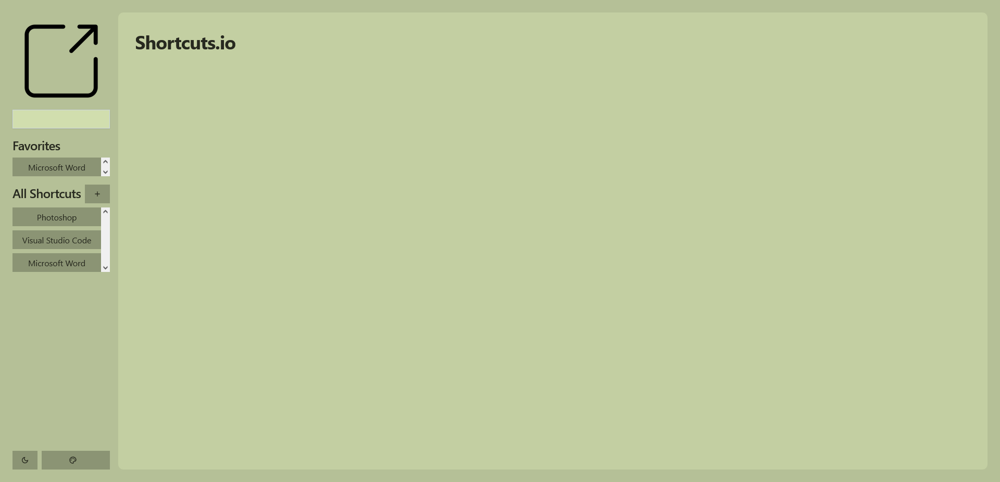
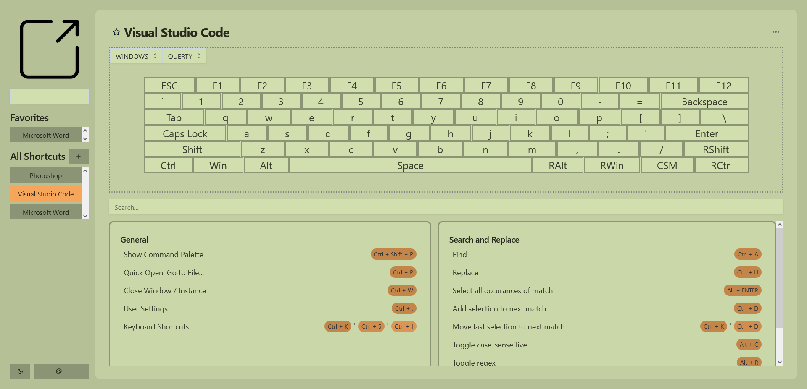
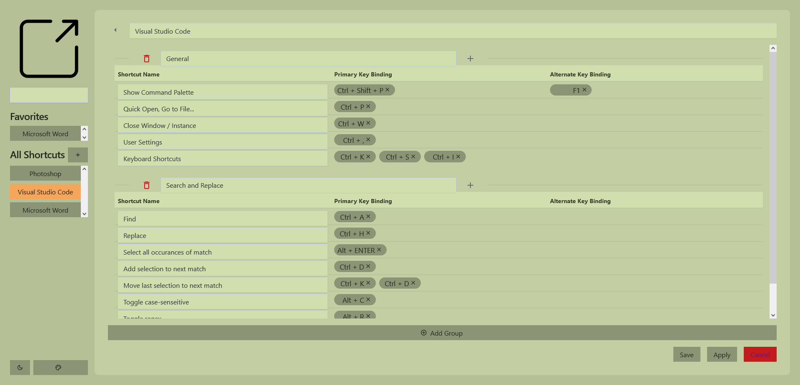

# Overview
An app to view and maintain shortcuts from different applications

### Home Page

### Shortcut Page

### Shortcut Edit Page

# Dependencies
### Frontend
- React
- Typescript
- JOY MaterialUI
- Color.js
### Backend
- Typescript
- Express
- MongoDB
- Mongoose

## Todo: 
- ~~Rework object model to be under one record instead of partitioned into multiple~~
- ~~Add more shortcut, shortcutGroups and applications into the DB~~
- ~~Allow for keyboard sequences and alternate shortcut inputs~~
- ~~Allow for shortcuts to be added and removed through the UI~~
    - ~~JSON Edit~~ [removed]
    - ~~Key-Value Edit~~
- ~~Create favorites section in sidebar~~
- ~~Allow json export~~
- ~~Delete application through ui~~
- ~~Create application through ui~~
- ~~Allow for main page color scheme to be changed from select color schemes~~
- ~~Allow for main page themes to be changed from select themes~~
- ~~Home Page~~

## Things to keep in mind for future iterations: 
- If the app is small, create MongoDB structure as a model instead of multiple models; did not need to create a separate record for shortcut, shortcut group and application since the project navigation path would not allow for individual models to be retrieved without having to pass through application > shortcut group > shortcut
- Make use of React.createContext and React.useContext more often, especially in large component/page files. 